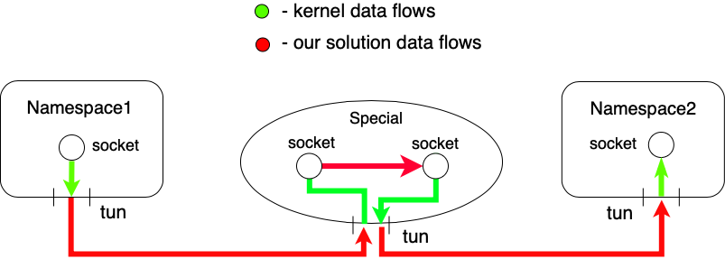

Net Playground [](https://travis-ci.org/raid-7/tun-example)
===============

### Can I run it on Mac?

The system is Linux-only primarily because of using `epoll` for io multiplexing.

### How to build and run?

```sh
mkdir build
cd build
cmake ..
cmake --build .
./plg -h # prints help
./plg --record -s 10.0.0.0/24 -f dump.traffic exe1 exe2 exe3 ...
```


### What does it do?

The system runs a number of processes in an isolated network environment and records or replays TCP traffic between these processes.

##### What about UDP/ICMP/etc?

Non-TCP packets are passed between processes as is. They are not recorded now.

##### What about IPv6?

IPv6 is not supported now. IPv6 packets are dropped.

##### Can I run it Jenkins/Travis CI/Circle CI?

Yes! See an example. All traffic is dumped to one file, which you can be export from your CI system and then replayed and analyzed.

### How does it work?

The system utilizes Linux namespaces and TUN devices. It runs each command specified in command line arguments in a separate network container which consists of a network interface and a TUN device, located in this namespace. Non-TCP packets from all TUN devices are passed as is to their destination. The way of TCP packets is more complicated.
TCP is a powerful protocol providing stable high-level abstractions on top of real unreliable network. It utilizes a number of techniques to control packet delivery and order of data. Due to Sequential and acknowledgment numbers in TCP headers replaying packets as is does not make sense. The system uses the following approach.

Another network namespace with tunnel inside is created apart from namespaces for user processes. All TCP packets from user namespaces are routed to this special namespace, but before that they are analyzed in order to find a [SYN] packet opening a new TCP connection. When such packet appears, a pair of sockets  is created in a special namespace. We call this pair of sockets a pipe. The first one accepts the new connection, and the second socket opens a connection to the original destination. Due to address masquerading user processes cannot find out that they communicate with fake sockets.
In record mode traffic from each sockets of the pipe is read, dumped and put to the other socket. In replay mode the traffic from each socket is read, thrown away and respective dumped data is written to the other socket.
The next picture demonstrates the path of the TCP packet.

Picture.

### License

The code is provided under MIT License except the CLI11 library, which has its own license.
